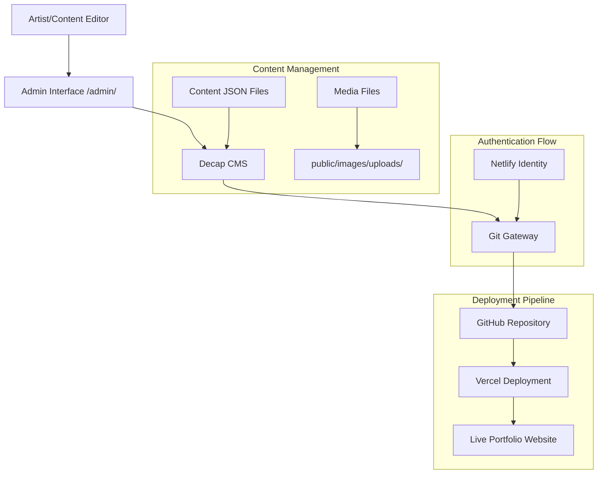

# Design Document

## Overview

This design integrates Decap CMS into the existing Next.js artist portfolio website to enable content management through a web-based interface. The solution leverages Git Gateway for authentication and maintains compatibility with Vercel deployment while preserving the existing JSON-based content structure.

The design addresses the unique challenge of deploying on Vercel (instead of Netlify) while using Netlify's Identity service for authentication, ensuring the artist can manage content independently without requiring technical knowledge.

## Architecture

### High-Level Architecture



### Component Architecture

The system consists of several key components:

1. **Admin Interface**: Static HTML page served at `/admin/` that loads Decap CMS
2. **Authentication Layer**: Netlify Identity + Git Gateway for secure access
3. **Content Management**: Decap CMS configuration managing JSON collections
4. **Media Management**: File upload system storing images in `public/images/uploads/`
5. **Deployment Integration**: Git-based workflow triggering Vercel rebuilds

## Components and Interfaces

### 1. Admin Interface Configuration

**Location**: `public/admin/index.html`

The admin interface serves as the entry point for content management. It includes:
- Decap CMS script loading from CDN
- Netlify Identity widget integration
- Redirect handling for post-authentication flow

**Key Features**:
- Responsive design for mobile content editing
- Session management and security
- Error handling for authentication failures

### 2. CMS Configuration

**Location**: `public/admin/config.yml`

The configuration defines content collections matching the existing JSON structure:

**Collections Structure**:
- **Gallery Collection**: Manages artwork entries with metadata
- **Shop Collection**: Handles product listings and store links  
- **Events Collection**: Manages event information and scheduling
- **Pages Collection**: Controls static page content (About, Contact)
- **Settings Collection**: Site-wide configuration and social links

**Field Types Used**:
- `string`: Text inputs for titles and names
- `text`: Multi-line text areas for descriptions
- `markdown`: Rich text editor for formatted content
- `image`: File upload with preview for artwork and media
- `datetime`: Date/time picker for events
- `select`: Dropdown menus for categories and stores
- `list`: Dynamic arrays for managing multiple items
- `object`: Nested data structures for social links

### 3. Authentication System

**Components**:
- **Netlify Identity**: User management and authentication
- **Git Gateway**: Repository access without direct Git permissions
- **Session Management**: Secure token handling and renewal

**Authentication Flow**:
1. User navigates to `/admin/`
2. Netlify Identity widget prompts for login
3. Successful authentication redirects to admin interface
4. Git Gateway provides repository access via API tokens
5. CMS operations commit directly to repository

### 4. Content Data Models

The design maintains the existing JSON structure while adding CMS management capabilities:

**Gallery Model**:
```json
{
  "artworks": [
    {
      "id": "string",
      "title": "string", 
      "description": "text",
      "imageUrl": "image_path",
      "imageHint": "string",
      "width": "number",
      "height": "number",
      "category": "select_option"
    }
  ]
}
```

**Shop Model**:
```json
{
  "items": [
    {
      "id": "string",
      "name": "string",
      "imageUrl": "image_path", 
      "imageHint": "string",
      "store": "select_option"
    }
  ]
}
```

**Events Model**:
```json
{
  "events": [
    {
      "id": "string",
      "title": "string",
      "description": "text",
      "date": "datetime",
      "location": "string",
      "link": "string",
      "imageUrl": "image_path"
    }
  ]
}
```

### 5. Media Management System

**Upload Directory**: `public/images/uploads/`
**Public Path**: `/images/uploads/`

**Features**:
- Automatic file organization by upload date
- Image optimization and compression
- Preview generation for admin interface
- Duplicate file handling
- File type validation (jpg, png, gif, webp)

### 6. Vercel Integration

**Deployment Trigger**: Git commits to main branch
**Build Process**: Next.js static generation with updated content
**Environment Variables**: Authentication tokens and API keys

**Vercel Configuration Considerations**:
- Static file serving for admin interface
- API route handling for webhook processing
- Environment variable management for authentication
- Build optimization for content changes

## Error Handling

### Authentication Errors
- **Invalid Credentials**: Clear error messaging with retry options
- **Session Expiry**: Automatic redirect to login with context preservation
- **Network Issues**: Offline detection with retry mechanisms

### Content Management Errors
- **Validation Failures**: Field-level error display with correction guidance
- **Upload Failures**: Progress indication with retry capabilities
- **Save Conflicts**: Conflict resolution interface for concurrent edits

### Deployment Errors
- **Build Failures**: Error reporting in admin interface
- **Git Conflicts**: Automatic conflict resolution where possible
- **Network Timeouts**: Retry logic with exponential backoff

## Testing Strategy

### Authentication Testing
- Login/logout flow validation
- Session persistence across browser sessions
- Multi-user access scenarios
- Permission boundary testing

### Content Management Testing
- CRUD operations for all content types
- File upload and media management
- Form validation and error handling
- Data integrity across save operations

### Integration Testing
- Git Gateway communication
- Vercel deployment triggers
- Content synchronization between CMS and live site
- Cross-browser compatibility

### User Acceptance Testing
- Artist workflow simulation
- Content editing scenarios
- Mobile device compatibility
- Performance under typical usage

## Security Considerations

### Authentication Security
- Secure token storage and transmission
- Session timeout configuration
- Multi-factor authentication support
- Access logging and monitoring

### Content Security
- Input validation and sanitization
- File upload restrictions and scanning
- XSS prevention in rich text content
- CSRF protection for form submissions

### Repository Security
- Limited Git Gateway permissions
- Branch protection rules
- Commit signing verification
- Audit trail for content changes

## Performance Optimization

### Admin Interface Performance
- CDN delivery for CMS assets
- Lazy loading for large content collections
- Image thumbnail generation
- Caching strategies for frequently accessed data

### Deployment Performance
- Incremental static regeneration
- Optimized build processes
- Content-based cache invalidation
- Progressive image loading

## Deployment Configuration

### Netlify Setup (Authentication Only)
- Identity service configuration
- Git Gateway enablement
- User invitation management
- Custom domain configuration for admin access

### Vercel Setup (Hosting)
- Repository connection and build configuration
- Environment variable management
- Custom domain and SSL configuration
- Analytics and monitoring setup

### Environment Variables Required
- `NETLIFY_SITE_ID`: Site identifier for Identity service
- `NETLIFY_ACCESS_TOKEN`: API access for Git Gateway
- `NEXT_PUBLIC_NETLIFY_SITE_URL`: Site URL for authentication redirects

## Migration and Rollback Strategy

### Content Migration
- Existing JSON structure preservation
- Gradual migration of content types
- Backup procedures for content changes
- Rollback mechanisms for failed deployments

### Deployment Rollback
- Git-based version control for content
- Vercel deployment history and rollback
- Database backup and restoration procedures
- Emergency access procedures for critical issues